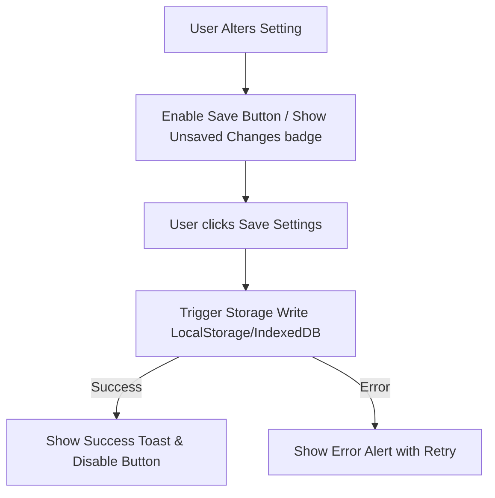

# Design Document: "Save Settings" Button for FlashRead

This document outlines the UX/UI design specifications and interaction flow for adding a "Save Settings" action to the Settings page.

---

## 1. Context & Rationale

Currently, settings are kept in local React state and applied in-memory, but not persistently stored. Additionally, changing values updates the interface immediately without an explicit save action, which lacks a clear "confirmation" beat for users who want to make multiple adjustments and commit them securely. 

A central "Save Settings" action provides a clear completion state, allows us to trigger actual disk writes (e.g., to LocalStorage or IndexedDB) only when requested, and offers instant success/error feedback.

---

## 2. Visual Design & Placement

### Placement
The button will be placed in a **fixed/sticky bottom bar** on mobile viewports and as a **prominent primary button at the end of the settings form** on desktop viewports. This ensures it is always accessible without forcing the user to scroll to the very bottom of long settings lists.

### Component Styling
* **Type**: Filled Primary Button.
* **Colors**: Sunset Orange/Cyan Accent (`bg-primary` mapping to `#004ac6` in light and `#2563eb` in dark).
* **States**:
  - **Normal**: `bg-primary text-on-primary` with hover brightness scaling.
  - **Hover**: Subtle scale-up animation and hover overlay (`brightness-115`).
  - **Active/Pressed**: `scale-95` transition.
  - **Disabled**: Greyed out `bg-surface-container-high` when there are no unsaved changes.

---

## 3. Interaction Flow

### Flow Details
1. **Dirty State Detection**: The button is disabled by default. As soon as the user changes any slider, toggle, or font option, the button transitions to its **enabled (active)** state, and a subtle "Unsaved changes" indicator badge appears.
2. **Commit Actions**: Clicking the button triggers a persist call to the browser's storage service.
3. **Feedback UI**:
   - A loading spinner icon (`Loader2` or material symbol `sync` rotating) replaces the button label text during storage write.
   - Upon completion, the button shows a green checkmark check icon and goes back to disabled state.
   - A floating Toast Notification appears at the bottom-right of the screen for 3 seconds:
     - **Success**: *"Settings saved successfully!"*
     - **Error**: *"Failed to save settings. Please try again."*

---

## 4. Accessibility (a11y)

* **Keyboard Navigation**: The button is fully focusable (`tabindex="0"`) and triggerable via `Enter` or `Space`.
* **Aria Role**: `aria-label="Save all changes to settings"`
* **Screen Reader**: Updates the status using a live region (`aria-live="polite"`) when settings are successfully persisted.
